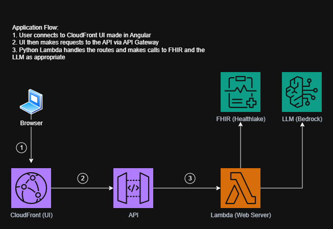

# 🩺 LLM Diagnosis: FHIR-Based Disease Prediction



This application leverages **Amazon Bedrock** to interpret **FHIR (Fast Healthcare Interoperability Resources)** data. By using Supervised Fine-Tuning (SFT), the model is trained to analyze medical bundles and suggest potential diagnoses with clinical reasoning.

---

## 🏗️ Infrastructure as Code (IaC)

The environment is managed via **Terraform** to ensure a reproducible and secure medical data perimeter. The infrastructure is designed as a **self-orchestrating pipeline** that handles the asynchronous nature of LLM training. The configuration is split into functional modules:

* **`provider.tf`**: Configures the AWS provider and pins the region to `us-east-1`to access the **Nova 2 Lite** foundation models.
* **`main.tf`**: Contains the **Frontend** (S3 + CloudFront OAC), **Bedrock Customization** (KMS Keys for HIPAA-compliant encryption), **IAM Trust Relationships**, and global networking.
* **`api.tf`**: Defines the **API Gateway** and **Lambda** backend infrastructure, including the environment variable injection for the fine-tuned model ARN.
* **`variables.tf`**: Manages environment-specific variables like Model IDs and Resource Naming. New variable `skip_fine_tuning` centralizes the "Fast vs. Full" logic. It dynamically selects between a fresh Fine-Tuning Job ARN or a static Foundation Model ARN based on the deployment flag.
* **`data.tf`**: Automates the validation and secure upload of FHIR-formatted training/validation datasets to the S3 data lake.
* **`fine_tuning.tf`**: Orchestrates the **Bedrock Customization Job**. This includes hyperparameter configuration (Epochs, Batch Size) and the **Provisioned Throughput** (dedicated GPU units) for the final model.

## 🤖 Automated Training Pipeline

A unique feature of this IaC setup is the **Asynchronous Waiter Protocol** paired with a **Hybrid Execution Toggle**.

* **Fast Dev Mode**: Bypasses the 90-minute Bedrock training job. It points the Lambda and API directly to a base Foundation Model (Nova 2 Lite), allowing for rapid iteration on the Angular UI and Python backend.

* **Full Training Mode**: Triggers the wait_for_model.sh script, which blocks downstream deployment until the Supervised Fine-Tuning (SFT) is 100% complete and the Provisioned Throughput is active.

* `wait_for_model.sh`: A specialized shell script that polls the AWS API to monitor the InProgress status of the Nova 2 Lite training.
* `terraform_data` **(The Waiter)**: A lifecycle-managed resource that blocks the deployment of the Lambda and API until the model is 100% trained. This ensures a "one-click" deployment experience without manual intervention between training and inference.

### Deployment & Usage

1. Navigate to the `iac/` directory.
2. Run `terraform init` to download providers.
3. Run `terraform apply` to sync changes with your AWS account.

### 🏎️ Developer Acceleration: Skip Mode

To optimize the developer experience, this project includes a **Hybrid Deployment Toggle**. Fine-tuning a medical LLM is a high-latency operation (~3 hours); therefore, developers can toggle between two modes via `variables.tf` or CLI flags:

### 1. Fast Mode (`skip_fine_tuning = true`)

* **Purpose:** Rapid iteration on UI, API Gateway, and Lambda logic.
* **Behavior:** Bypasses the `aws_bedrock_custom_model` resource and the Asynchronous Waiter script.
* **Result:** Points the infrastructure to a previously created custom model. Deployment time is reduced to **< 2 minutes**.

### 2. Full Mode (`skip_fine_tuning = false`)

* **Purpose:** Final model validation, performance testing, and production deployment.
* **Behavior:** Triggers the full SFT (Supervised Fine-Tuning) job and invokes the `wait_for_model.sh` polling script.
* **Result:** Creates a new custom-trained model.

### Usage

To switch modes without modifying the source code, use the following CLI command:

```bash
# Deploy in Fast Mode for UI testing
terraform apply -var="skip_fine_tuning=true"

# Deploy in Full Mode for Fine-Tuning
terraform apply -var="skip_fine_tuning=false"
```

### Creating all from a blank slate

1. run terraform apply with `skip_fine_tuning` false
2. paste output of `nova_model_arn` into `active_model_arn` tf variable
3. run terraform apply with `skip_fine_tuning` true
4. manually create on-demand model in AWS
5. paste deployment ARN of that model into tf local `deployment_model_arn`
6. run terraform apply with `skip_fine_tuning` true again

---

## 🧠 Bedrock & Fine-Tuning

We use **Supervised Fine-Tuning** to teach the LLM how to parse specific FHIR JSON structures (e.g., `Observation` and `Condition` resources).

### Training Workflow

1. **Data Prep**: Generate `.jsonl` files where each line follows the Bedrock format:
    `{"prompt": "Analyze FHIR: <JSON>", "completion": "Diagnosis: <Result>"}`
2. **Storage**: Upload training datasets to the S3 bucket defined in `main.tf` (encrypted via KMS).
3. **Job Submission**: Submit the customization job using the `BedrockFineTuningServiceRole` created by Terraform.

## 🛠️ Utility Scripts

### 🛠️ FHIR to JSONL Converter Tool (`FhirToBedrockJsonConverter.exe`)

A C# .NET utility designed to bridge the gap between raw Synthea FHIR bundles and Amazon Bedrock training requirements. It automatically extracts clinical **Observations** (Lab results) for the prompt and maps the **active Condition** as the ground-truth diagnosis for the completion.

#### Features

* **Batch Processing**: Loops through an entire directory of JSON bundles.
* **Clinical Filtering**: Strips metadata noise and extracts only relevant LOINC codes and values.
* **Error Resilience**: Skips malformed bundles without interrupting the batch job.

```bash
# Syntax
./FhirToBedrockJsonConverter.exe <input_directory> <output_file_path>

# Example
./FhirToBedrockJsonConverter.exe ./fhir_samples ./training_data.jsonl
```

### 🛠️ Model Invocation Test (`invoke_LLM.sh`)

This script allows for manual testing of the custom model deployment via the AWS CLI. It is designed to bypass the Lambda and API Gateway layers to verify model inference and performance directly.

#### 📋 Prerequisites

* AWS CLI: Must be installed and configured with appropriate permissions.
* Deployment ARN: Requires a valid Amazon Bedrock Custom Model Deployment ARN.

#### 🚀 Usage

To use the script, provide the Deployment ARN as the first argument. You can optionally provide a custom Base64-encoded JSON body as the second argument.

```bash
# Run with a Deployment ARN (uses the default medical query)
sh ./invoke_LLM.sh <DEPLOYMENT_ARN>

# Run with a custom Base64-encoded payload
sh ./invoke_LLM.sh <DEPLOYMENT_ARN> [YOUR_BASE64_BODY]
```

#### 🧠 Script Logic

* Default Payload: If no second argument is provided, the script uses a hardcoded Base64 string that asks the model: "What are the symptoms of appendicitis?"
* Output: The model's response is saved to a unique, timestamped file (e.g., response_1712590000.json) and printed directly to the terminal for immediate review.

---

## ⚡ Lambda Development

[Todo: maybe change the below in API Handler and building]: #

### API Handler

The main (only) lambda is a python lambda ```api_handler.py```. This has the logic for an example route that can easily be copied if we need more. The API Gateway is set up to handle all routes so changes there won't be necessary.

### Building

Running `terraform apply` will automatically handle the building and deployment of the python script.

## 💻 UI Development (Angular)

The frontend allows for interactive FHIR bundle uploads and visualizes the LLM's diagnostic reasoning.

1. Navigate to the /ui/llm_diagnosis directory.
2. Build the production artifacts:```ng build```
3. Deploy to the frontend S3 bucket: ```aws s3 sync ./dist/llm_diagnosis/browser s3://cs-6440-88-llm-diagnosis-front-end```

 [Note to UI developer: handle these deployment steps automatically with terraform]: #

## 🛡️ Security & Privacy (HealthLake)

* **Least Privilege**: IAM roles are scoped specifically to the bedrock.amazonaws.com service principal.
* **Bucket Isolation**: S3 policies strictly enforce SourceAccount and SourceArn checks to prevent cross-tenant data access during logging.

## 🚀 Usage

1. Run terraform apply and note the cloudfront_domain_name output.
2. Access the application via the CloudFront URL.
***Important***: Due to limitations with Terraform, the On-Demand model must be created manually after finishing the `terraform apply` command.

---

## 🧪 Testing & Validation

This project uses native **Terraform Tests** to validate our PII redaction logic before any infrastructure is deployed. This serves as a "fail-fast" mechanism to ensure no Sensitive Health Information (PHI) is accidentally synced to AWS.

### Prerequisites

Before running tests, you must initialize the test directory to download the required `hashicorp/external` provider.

```bash
cd iac/tests/redaction
terraform init
```

### Running the Redaction Tests

To verify the Python redaction logic against FHIR Patient and Bundle resources, execute the following:

```bash
terraform test
```

***Important***: Our environment relies on a shared PYTHONPATH configured in .vscode/settings.json. If Python cannot find redact_PII, Use the Integrated Terminal: Ensure you are using the terminal inside VS Code, not a standalone PowerShell or CMD window.

## 🗺️ Roadmap

**Healthlake**: Integration for longitudinal patient data storage.
**Route 53**: Custom domain mapping for the CloudFront distribution.
# HealthLLM

# HealthLLM

# HealthLLM
